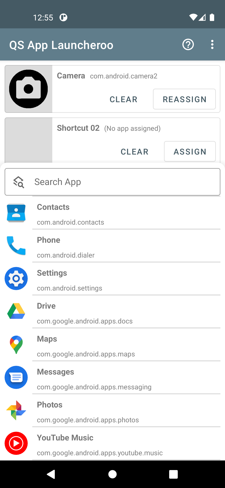
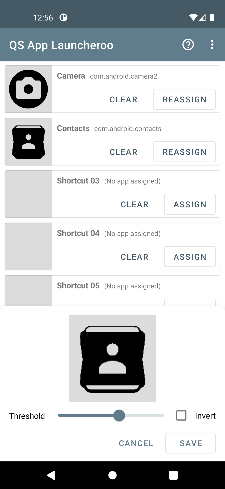
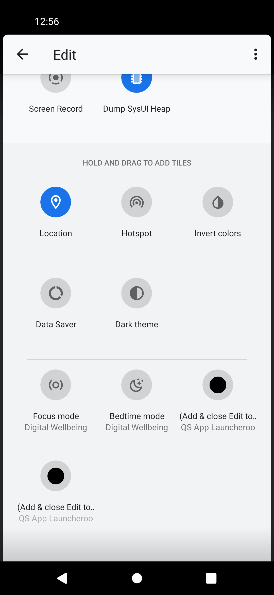
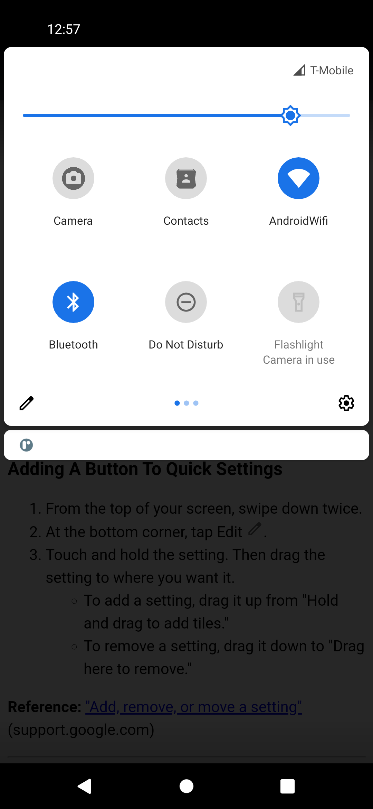
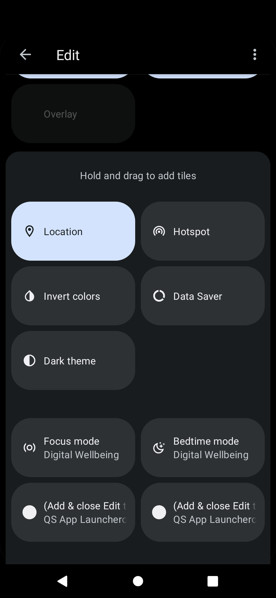
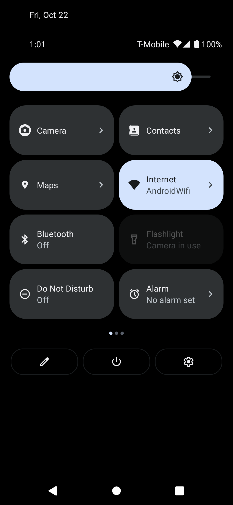
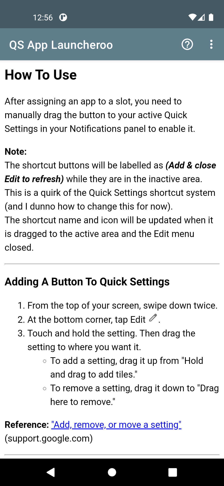

## QS App Launcheroo
  

### Description ###

Launch an app from a Quick Settings button.

Ever wanted to open any app from the Notification shade? Now you can!

The button icon is generated as a monochrome version of the selected app icon - if the default threshold looks weird, adjust tap the icon and adjust the slider to your liking.

How to add / remove Quick Settings buttons: https://support.google.com/android/answer/9083864

### Download ###

* https://play.google.com/store/apps/details?id=com.justbnutz.quicksettingsapplauncheroo

### Screenshots ###

### Contact ###

* [Brian Lau](https://about.me/Brian.YH.Lau)